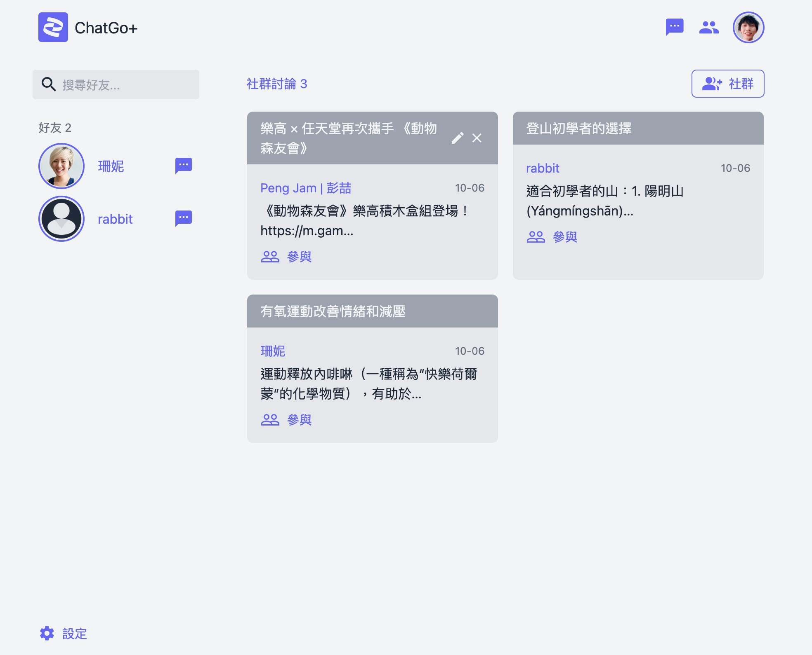
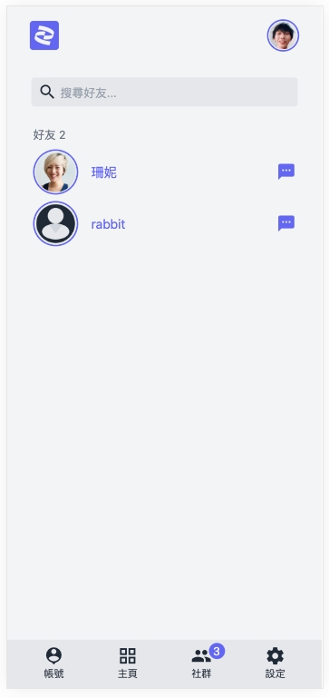

# ChatGo＋

###  Preview :

<table width="100%"> 
<tr>
<td width="50%">      
&nbsp; 
 

  Web 

</td> 
<td width="30%">
 

  App

</td>
</tr>
</table>

#

## 專案說明
以聊天室為主題設計，模擬聊天時即時傳遞文字至群組的功能。

#
### 使用環境
- `Python3`。

### 使用技術
- 以 `Django` 框架開發。
- 使用 ASGI 異步編程 `Websocket` 實現網路雙向通信與持久連接的數據傳輸。
- `HTML`、`Tailwind CSS`、`JavaScript`。

### 使用套件
- `Django`
- `channels`
- `mysqlclient`
- `Pillow`
- `whitenoise`
- `tailwind`
